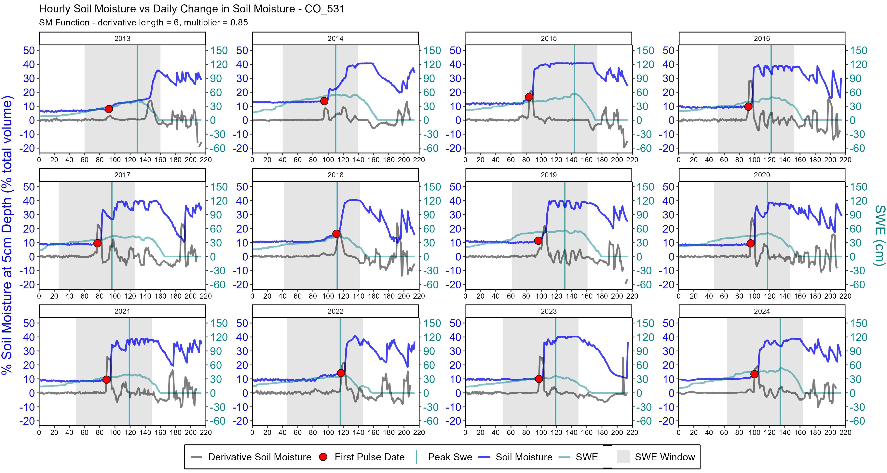

# Welcome to snotelprocessr!

[](http://dx.doi.org/10.5281/zenodo.15178610)

snotelprocessr was created to download, process, and analyze large
amounts of SNOTEL data at once. The scripts and functions included can
be used for a single station, or hundreds at once. Within the
“examples” folder you can find example .R scripts for various
processing and analysis workflows, in addition to the
snotelprocessr_workflow_demo.Rmd, which will walk you through
downloading raw data and processing it for future analyses. 
The "R" folder contains all necessary functions for running through analysis and data downloading workflows.

## Included example scripts:

- extract_snotel_peak_swe.R

  - Extract peak SWE day of year (DOY) from your processed SNOTEL data.
    Returns a CSV file with peak SWE DOY for each year/station

- extract_snotel_soilmoisture_pulse.R

  - Extract soil moisture pulse DOY from your processed SNOTEL data.
    Returns a CSV file with soil moisture DOY for each year/station

- export_snotel_soilmoisture_plots.R

  - Create and export faceted plots for your processed SNOTEL data.
    These plots will show soil moisture curves with plotted pulse dates,
    in addition to SWE and derivative curves for context:

    

- compute_snotel_snowfree.R

  - Computes snow presence and snow-free DOY based on observations of
    snow depth.

- compute_50p_peakSWE_window.R

  - Computes 50% peak SWE DOY for each year (in other words- what DOYs
    the SWE curve cross 50% of peak SWE)

## Installing snotelprocessr

You can install the latest version (1.0.0) of snotelprocessr like
this:

``` r
devtools::install_github("allydetre/snotelprocessr", build_vignettes = TRUE)
library("snotelprocessr")
```

## 

Feel to free to reach out to me with any questions/comments at
a.detre@colostate.edu!

Ally Detre
